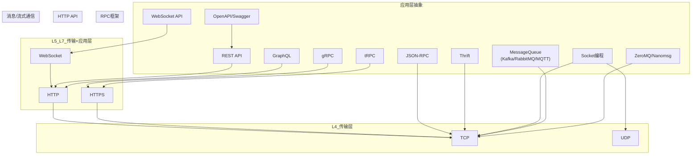

>参考内容来源：
>视频
>1. [【API技术核心原理】REST | GraphQL | gRPC | tRPC](https://www.bilibili.com/video/BV1yL41167fD/?share_source=copy_web&vd_source=082d632aa56c8a143515b66648c7e6a4) By 技术蛋老师
>2. [RPC是什么？HTTP是什么？RPC和HTTP有什么区别？](https://www.bilibili.com/video/BV1Qv4y127B4/?share_source=copy_web&vd_source=082d632aa56c8a143515b66648c7e6a4) By 小白Debug
>    备注：该视频有一些说法不太准确的地方，弹幕和评论均有说明

# 关于层级问题

![[Pasted image 20250807115347.png]]