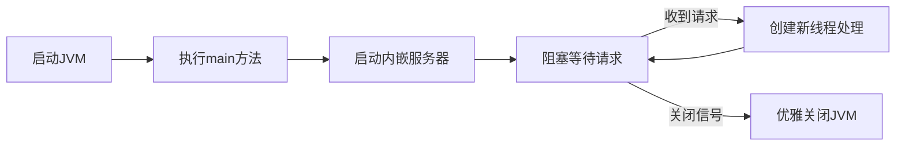

# 1 编译运行过程

[[不同语言的执行模型的区别|和其他语言的对比]]

Java 编译过程包含了从源代码到可执行的字节码文件的转换，这个过程通常通过 Java 编译器 (`javac`) 来完成。编译时会执行一系列的步骤，下面是 Java 编译时发生的主要过程：

## 1.1 **源代码编译 (`javac`)**

当你编写好 Java 源代码文件（例如 `HelloWorld.java`）后，使用 `javac` 命令来编译这些文件。`javac` 编译器将源代码转化为 Java 字节码（`.class` 文件），以便 JVM（Java 虚拟机）能够执行。

编译过程具体步骤包括：

- **词法分析**：将源代码分解为记号（tokens）。例如，关键词、标识符、常量等。
    
- **语法分析**：根据语法规则解析源代码，确保代码结构符合语言规范。
    
- **语义分析**：检查代码是否符合语义规则，比如变量类型是否匹配、方法调用是否正确。
    
- **生成字节码**：将符合规范的源代码转化为字节码文件，字节码文件即为 `.class` 文件。
    

## 1.2 **生成字节码（`.class` 文件）**

编译器将每个源代码文件（`.java`）编译成一个或多个字节码文件（`.class`）。这些 `.class` 文件包含了编译后的中间代码，也就是 Java 程序在 JVM 上执行所需的指令。

## 1.3 **资源文件的处理**

在编译过程中，除了 Java 源代码文件（`.java`）会被编译成 `.class` 文件，`resources` 目录下的资源文件（如 `.properties`、`.xml`、图片文件等）也会被处理。具体的步骤包括：

- **Maven/Gradle 构建时的资源复制**：如果你使用的是构建工具（如 Maven 或 Gradle），这些工具会自动将 `resources` 文件夹中的资源文件复制到输出目录中（通常是 `target/classes` 或 `build/classes` 目录）。
    
- **IDE 中的资源文件处理**：在 IDE 中，资源文件也会被复制到相应的输出目录，确保它们能被类加载器加载。
    

## 1.4 **类路径设置**

在 Java 编译过程中，`classpath`（类路径）用于指定编译器和运行时如何找到相关的类和资源文件。在编译时，编译器会根据 `classpath` 查找并引入依赖的类库（如 `.jar` 文件），确保编译过程能够正确引用到所有的外部依赖。

## 1.5 **编译器检查和错误提示**

编译时，`javac` 会对代码进行检查，确保没有语法错误、类型错误等问题。如果编译失败，`javac` 会输出错误信息并停止编译。常见的编译错误包括：

- 语法错误（如漏掉分号、括号不匹配等）
    
- 类型错误（如方法调用时参数类型不匹配）
    
- 引用未定义的变量或类
    

## 1.6 **生成 JAR 文件（可选）**

如果项目需要打包成 `.jar` 文件，你可以在编译完成后将 `.class` 文件和资源文件打包到一个 `.jar` 文件中。这个过程通常是通过构建工具（如 Maven 或 Gradle）来完成的。

- **Maven 构建**：Maven 使用 `pom.xml` 配置文件来指定项目的依赖和打包规则，执行 `mvn package` 命令时会将编译后的 `.class` 文件和资源文件打包成 `.jar` 文件。
    
- **Gradle 构建**：Gradle 使用 `build.gradle` 配置文件，执行 `gradle build` 时，会将项目打包成 `.jar` 文件。
    

## 1.7 **JVM 加载与执行**

编译后得到的字节码文件（`.class` 文件）可以通过 JVM 加载并执行。JVM 会负责将字节码转换为机器码并执行程序。

JVM 加载过程如下：

- **类加载**：JVM 根据类加载器（`ClassLoader`）从 `classpath` 中加载字节码文件。
    
- **验证字节码**：JVM 会验证字节码，确保没有安全隐患和违反 Java 内存模型的操作。
    
- **解释执行**：JVM 逐行解释执行字节码，或者将字节码编译为本地机器码（JIT 编译）来加速执行。
    

## 1.8 总结编译时的主要步骤：

1. **编译源代码**：将 `.java` 文件编译成 `.class` 文件。
    
2. **处理资源文件**：将资源文件（如 `.properties`）复制到输出目录中。
    
3. **类路径设置**：通过 `classpath` 找到外部依赖和资源。
    
4. **生成 JAR 文件（可选）**：打包 `.class` 文件和资源文件，生成 `.jar` 文件。
    
5. **加载字节码**：JVM 使用类加载器加载 `.class` 文件，进行字节码验证并执行。
    

这些过程确保了你的 Java 程序能够被正确编译、打包和执行。


# 2 那java从原始的“文本”的代码文件，到实际运行等又做了什么？

我给你梳理一下 **Java 从源代码（文本）到实际运行** 的全过程，并且跨层解释，从 Java 语法 → 编译器 → JVM → 操作系统 → 硬件，保证你能把它和存储、执行的知识体系连起来。

---

## 2.1 源代码阶段（文本）

- 你写的 `.java` 文件本质是 **纯文本文件**（字符编码 UTF-8/GBK 等）
    
- 存储在磁盘（文件系统），OS 负责文件的物理位置和读写
    
- Java 编译器（`javac`）会读取它的**字节流**，解析成语法树
    

---

## 2.2 编译阶段（javac）

1. **词法分析**：  
    把字符流分成 token（关键字、标识符、常量、符号等）
    
2. **语法分析**：  
    根据 Java 语法规则生成抽象语法树（AST）
    
3. **语义分析**：  
    检查类型、作用域、访问修饰符等
    
4. **字节码生成**：
    
    - 编译器生成 `.class` 文件，包含：
        
        - **常量池**（字符串、类名、方法名、字面量等）
            
        - **方法字节码**（JVM 指令）
            
        - **字段、方法描述**
            
    - **此时你写的高层 `int x = 42;` 已经变成了 `iconst_42` + `istore_1` 这样的 JVM 指令**
        

**跨层映射**：

- 你的文本源代码变成了一种 **与 CPU 无关的二进制格式**（字节码），存储在磁盘中，OS 文件系统管理
    
- JVM 是它的解释者
    

---

## 2.3 类加载阶段（JVM 运行时）
当你执行：

```bash
java Main
```

流程是：

1. **Bootstrap 类加载器** 从磁盘（或 JAR、网络）读取 `.class` 文件到内存
    
2. JVM 把 `.class` 文件的二进制流解析成**运行时数据结构**：
    
    - 类元数据 → 方法区（Metaspace）
        
    - 运行时常量池
        
    - 字节码指令缓存
        
3. 初始化：
    
    - 分配静态变量
        
    - 执行 `<clinit>` 静态初始化块
        

**跨层映射**：

- 磁盘文件 → OS 读入缓冲区 → JVM 内部结构（内存）
    
- 不同类加载器可能从不同地方取数据（本地文件、网络、内存生成）
    

---

## 2.4 执行阶段

JVM 有两种执行模式：

1. **解释执行（Interpreter）**
    
    - 按字节码逐条解释为 CPU 指令
        
    - 速度慢，但启动快
        
2. **即时编译（JIT, Just-In-Time Compiler）**
    
    - 热点代码会被翻译成**本地机器码**（x86、ARM）并缓存
        
    - 下次执行直接跳过解释层
        

**跨层映射**：

- 字节码 → JIT 编译器生成汇编 → OS 分配可执行内存页 → CPU 执行
    
- 机器码执行时访问栈、堆、方法区，和 C 程序没区别
    

---

## 2.5 运行时内存布局（JVM 内部）

JVM 把内存分成：

- **栈**（每线程独立，存局部变量、方法调用帧）
    
- **堆**（存对象、数组，GC 管理）
    
- **方法区/Metaspace**（类元数据、常量池）
    
- **PC 寄存器**（记录当前线程执行的字节码位置）
    
- **本地方法栈**（调用 C/C++ 方法时用）
    

这些又是建立在 **OS 虚拟内存** 上，由页表映射到物理内存，最后是 CPU Cache / DRAM。

---

## 2.6 GC（垃圾回收）

- 当对象不再被引用，GC 会在堆中回收它
    
- GC 会停顿线程（Stop-the-world）、整理堆碎片
    
- 底层依赖 OS 内存分配（`malloc` / `mmap` 等）
    

---

## 2.7 OS 层作用

- JVM 本身是一个**本地进程**（C++ 写的）
    
- OS 提供：
    
    - 文件读取（加载 class/jar）
        
    - 虚拟内存分配
        
    - 线程调度（Java Thread → OS Thread）
        
    - 网络 I/O
        
    - 系统调用接口（native methods）
        

---

## 2.8 CPU 硬件层作用

- 执行 JIT 编译生成的机器码
    
- 使用寄存器、ALU/FPU 进行运算
    
- 利用 CPU Cache 加快堆/栈数据访问
    
- 通过总线访问 DRAM / IO
    

---

## 2.9 跨层全景图：Java 代码运行路径

```
[.java 文本文件]
   ↓ javac
[.class 字节码文件]   -- CPU 无关
   ↓ 类加载器
[JVM 内存中的类元数据 + 常量池 + 字节码]
   ↓ 解释执行 / JIT 编译
[本地机器码] -- CPU 可直接执行
   ↓
[OS 虚拟内存管理] -- 线程调度 / I/O
   ↓
[物理内存 / CPU Cache / 硬件执行单元]
```

---

如果你愿意，我可以帮你把 **Java 从源代码到执行** 和 **各种数据的存储/取用路径** 结合成一个**统一的跨层知识图谱**，这样你的“存储 + 执行”就可以一次性打通。  
这样一张图会同时展示 `.java → .class → JVM 内部结构 → OS → CPU` 的全过程。


# 3 从一个最简单的程序到持续运行的项目

理解Java程序的运行机制非常重要，从最简单的`main`方法到持续运行的项目（如Spring Boot），其底层原理有本质区别。下面分步骤解释：

---

## 3.1 最简单的Java程序（带main方法的类）如何运行？
### 3.1.1 **代码示例**
```java
public class HelloWorld {
    public static void main(String[] args) {
        System.out.println("Hello, World!");
    }
}
```

### 3.1.2 点击"三角号"运行时的底层过程

当你点击IDE（如IntelliJ IDEA）的运行按钮时，背后发生了以下关键步骤：
1. **编译**：IDE调用`javac`命令将`.java`文件编译成JVM可执行的字节码（`.class`文件）。
2. **启动JVM**：IDE执行`java HelloWorld`命令，启动Java虚拟机（JVM）。
3. **加载类**：JVM的**类加载器**加载`HelloWorld.class`文件到内存。
4. **执行main方法**：
   - JVM找到`public static void main(String[] args)`方法（**固定入口点**）。
   - 在**主线程**中逐行执行方法内的代码。
5. **程序结束**：
   - `main`方法执行完最后一行代码（此处是`System.out.println`）。
   - JVM自动退出，进程终止。

> ✅ **关键特点**：  
> - 单次执行，启动 → 运行 → 退出  
> - 生命周期仅由`main`方法控制

---

## 3.2 持续运行的项目（如Spring Boot）如何工作？

以Spring Boot项目为例：
```java
@SpringBootApplication
public class MyApp {
    public static void main(String[] args) {
        SpringApplication.run(MyApp.class, args); // 关键代码
    }
}
```

## 3.3 看似相同，实则不同

- 虽然也有`main`方法，但**它不会立即结束**。
- `SpringApplication.run()`启动后，会初始化一个**长期运行的进程**。

### 3.3.1 **持续运行的秘密**
| 机制                | 说明                                                                 |
|---------------------|----------------------------------------------------------------------|
| **内嵌Web服务器**   | Spring Boot启动Tomcat/Jetty等服务器，持续监听端口（如8080），等待HTTP请求。 |
| **事件循环(Event Loop)** | 服务器线程阻塞在`ServerSocket.accept()`，当请求到达时唤醒处理。       |
| **非守护线程(Non-Daemon Threads)** | Spring创建的线程默认为非守护线程，只要有一个在运行，JVM就不会退出。    |
| **上下文保持**      | Spring容器加载所有Bean并驻留内存，直到主动关闭。                      |

### 3.3.2 **生命周期对比**


> ✅ **关键特点**：  
> - 程序启动后**不退出**，等待外部事件（如HTTP请求）  
> - 通过**非守护线程**或**阻塞操作**保持JVM存活  
> - 需要显式终止（如Ctrl+C或`/actuator/shutdown`）

---

## 3.4 核心区别总结

| **特性**               | 简单main程序                          | Spring Boot类项目                     |
|------------------------|---------------------------------------|---------------------------------------|
| **启动入口**           | `main`方法                            | `main`方法（调用`SpringApplication.run`） |
| **JVM生命周期**        | `main`结束 → JVM退出                  | `main`结束后JVM仍运行                 |
| **运行机制**           | 顺序执行，一次性完成                  | 事件驱动（HTTP请求、消息等）           |
| **线程模型**           | 单线程（主线程）                      | 多线程（线程池处理并发请求）           |
| **终止方式**           | 自动退出                              | 需手动发送终止信号                    |
| **典型应用**           | 命令行工具、计算任务                  | Web服务、微服务、定时任务等            |

---

## 3.5 技术演进的关键点

1. **从同步到异步**  
   - 简单程序：同步执行完即退出。
   - 服务型程序：异步事件驱动（如Netty、Tomcat的NIO模型）。

2. **线程控制**  
   - Spring Boot通过线程池管理请求处理线程，主线程仅负责初始化。

3. **框架的魔法**  
   - Spring Boot在`run()`方法中隐藏了复杂逻辑：
     ```java
     // 伪代码：SpringApplication.run()的核心逻辑
     public void run() {
         initialize();       // 初始化容器
         startServer();      // 启动内嵌服务器（阻塞在此！）
         // 此处不会执行到，直到服务器关闭
     }
     ```

---

## 3.6 动手验证建议

1. **观察线程行为**  
   在Spring Boot启动后执行：
   ```java
   Thread.getAllStackTraces().keySet().forEach(t -> 
       System.out.println(t.getName() + " - " + (t.isDaemon() ? "守护线程" : "用户线程"))
   );
   ```
   你会发现大量**非守护线程**（如`tomcat-acceptor`）。

2. **模拟阻塞操作**  
   写一个永不退出的`main`方法：
   ```java
   public static void main(String[] args) throws InterruptedException {
       while (true) {
           Thread.sleep(1000); // 模拟长期运行
       }
   }
   ```

---

理解这些差异能帮助你掌握Java程序的运行本质。简单程序像放烟花🎆（瞬间结束），而服务型程序像发电机🔋（持续供电直到关闭）。Spring Boot等框架通过**封装线程管理和事件循环**，让开发者专注业务逻辑而非底层机制。